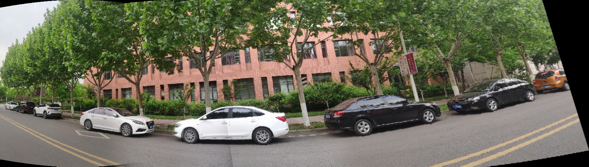

# Panoramic image stitching
***Author***: Shiwei Liu, [College of Artificial Intelligence, Nankai University](https://aien.nankai.edu.cn/)

***E-mail***: 2011832@mail.nankai.edu.cn
## About this program
This project is one of my assignments for the course "Computer Vision" during my sophomore year at Nankai University.It is used to stitch multi-images to a panoramic image. The main idea of this project is: First, input some images during lateral movement in sequence. Second, set a cylindrical transformation on those images. Third, compute SIFT feature points in each image and match them between two adjacent images by FLANN. Fourth, compute the transfer matrix and apply it through fuse by weighted mean method. Finally, crop the black edge and output the panoramic image.

This program works well when the number of input images is under 10. Put your own images in ```./imgs```, and you'd better rename those images by their order(such as ```001.png``` ```002.png```......)
## Requirements
1. Create a [conda](https://www.anaconda.com) environment by running this command(replace YOUR_ENV_NAME):
    ```
    conda create -n YOUR_ENV_NAME python==3.6 
    ```
    **Your python version must be 3.6** in order to run this program successfully. Activate this environment by running:
    ```
    conda activate YOUR_ENV_NAME
    ```
2. Install [Opencv](https://opencv.org/). Version 3.4.1.15 is required because the function ```xfeaturs2d.SIFT_create()``` is no longer       available in versions later than it:
    ```
    pip install opencv-python==3.4.1.15
    pip install opencv-contrib-python==3.4.1.15
    ```
3. Use ```pip``` tool to install other required package:
    ```
    pip install numpy
    pip install tqdm
    ```
4. Just run ```main.py``` to stitch your own panoramic image:
   ```
   python main.py
   ```
## Result
1. Your input images should have small lateral movement amplitude in order to increase matched SIFT features and get a better output.
<figure>
    
    
    
</figure>

<figure class="half">
    
    
</figure>
2. This program runs fast, and only spend few seconds. The result is shown bellow: 
   

